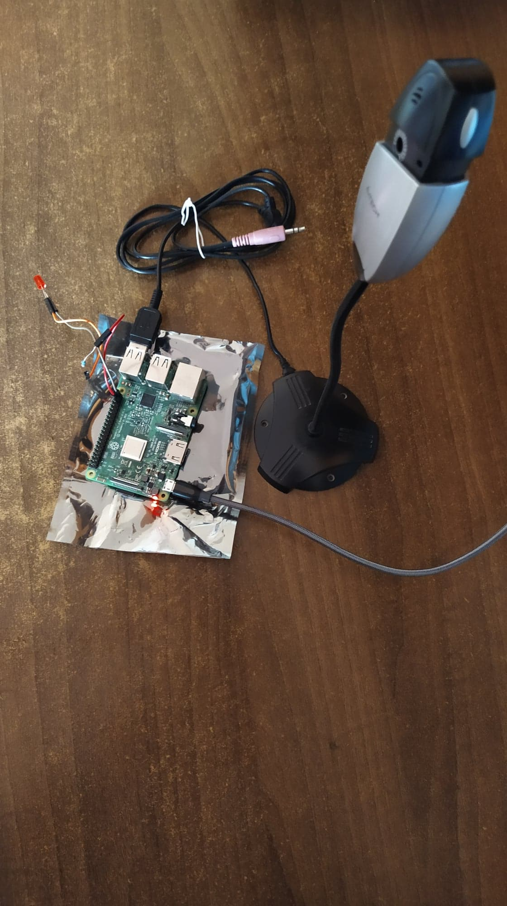
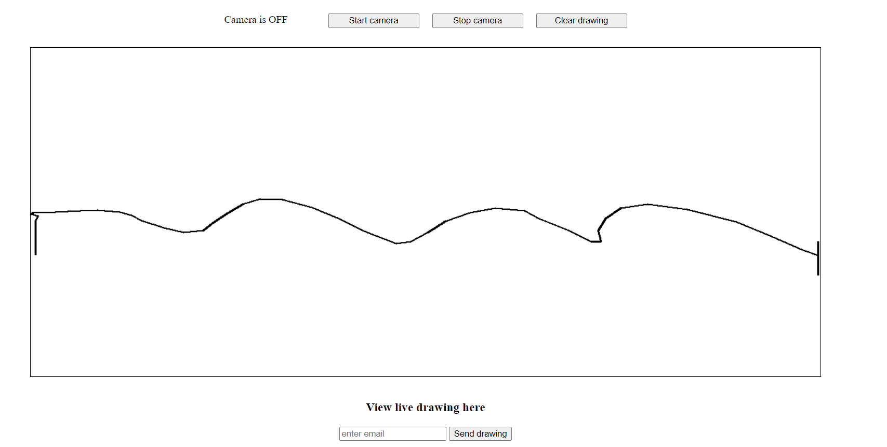

# Motion Tracking with RaspberryPi
A web server running on a RaspberryPi that uses a webcam and OpenCV to detect and track movements.

 

# Hardware Components
* **1x** RaspberryPi 3 Model B with Wireless LAN
* **1x** LED
* **1x** 300 Ohm rezistor
* **3x** male-to-male jumper wire
* **1x** web camera

# Software Components
* `python3.7` or later
* `Flask` on the server-side
* `HTML`, `CSS` and `JS` on the client-side
* `Pillow` for handling camera images
* `opencv-python` for image processing
* `RPi.GPIO` for I/O interface with the RaspberryPi

# Story
The project uses the power of modern image processing libraries in combination with the performance and portability of a RaspberryPi board to stream a live drawing done by motion tracking. 

The application mainly uses `python` for image processing and server logic. Using `opencv`, we extract the static background to determine which parts of a frame have changed. Then, by calculating the convex hull of the extracted set of points, we can track any desired point and plot its trajectory on a live graph, displayed in any browser that accesses the server's URL. 

In the end, the resulting drawing can be sent to a specified email address.
 

# Run It Locally
1. [Set up your RaspberryPi platform](https://projects.raspberrypi.org/en/projects/raspberry-pi-setting-up) and make sure it has access to a web camera

2. `git clone` the GitHub repository, or simply download the project source code
3. `$ cd server` to move into the source directory
4. `$ python3 -m venv env` to create a virtual environment
5. `$ source env/bin/activate` to activate the virtual environment
6. `$ pip3 install -r requirements.txt` to install all nevessary dependencies.

    This will install:
    * `Flask` version 1.1.2
    * `Pillow` version 7.0.0
    * `opencv-python` version 4.5.1.48
    * `RPi.GPIO` version 0.7.0
7. `$ python3 app.py` to launch the server
8. Open your browser and go to `http://localhost:6060`

# Project Structure

## Server-side
The project runs on 4 microservices written in `python3`. The main process is `app.py`, which starts the web server. When the client clicks on the *"Start Camera"* button, the `app.py` process launches a new instance of `camera.py` using the python `subprocess` module.
The `camera.py` script launches a `led.py` process which is responsible for controlling the LED.
The last microservice is `email_sender.py` which is also started by the main process when the user wants to send an email with the drawing output. The email is sent using `smtplib`.

## Client-side
The frontend of the project uses built-in `flask` static templates to render a view in the browser. The application uses some simple `JavaScript` to make *AJAX* requests to the server and to dynamically draw the received image on a `<canvas>` element.

# Code samples
Here is how we implemented some of the key features of the projects:
* Launching the `camera.py` process
```py
def launch_camera_listener():
    global camera_on

    with socket.socket(socket.AF_INET, socket.SOCK_STREAM) as sock:
        sock.bind(('localhost', CONFIG.CAMERA_PORT))
        sock.listen(1)
        (camera_sock, _) = sock.accept()

        while camera_on:
            message = camera_sock.recv(CONFIG.MESSAGE_LENGTH)
            if message == b'':
                camera_on = False
                break
            command = Command.from_bytes(message)
            global mutex
            with mutex:
                ih.paint(command.x, command.y)
        
        camera_sock.close()
```

* Motion tracking in OpenCV
```py
ret, frame = camera.read()
if not ret:
    print('Cannot read frame')
    break
frame = cv2.bilateralFilter(frame, 5, 50, 100)  # smoothing filter
frame = cv2.flip(frame, 1)  # flip the frame horizontally

img = remove_bg(bgModel, frame)
stop_x = int(cap_region_y_end * frame.shape[0])
start_y = int(cap_region_x_begin * frame.shape[1])
img = img[:stop_x, start_y:frame.shape[1]]  # clip the ROI

# convert the image into binary image
gray = cv2.cvtColor(img, cv2.COLOR_BGR2GRAY)
blur = cv2.GaussianBlur(gray, (blurValue, blurValue), 0)
ret, thresh = cv2.threshold(blur, threshold, 255, cv2.THRESH_BINARY)

# get the coutours
contours, hierarchy = cv2.findContours(thresh, cv2.RETR_TREE, cv2.CHAIN_APPROX_SIMPLE)
length = len(contours)

if length > 0:
    maxArea = -1
    for i in range(length):  # find the biggest contour (according to area)
        temp = contours[i]
        area = cv2.contourArea(temp)
        if area > maxArea:
            maxArea = area
            ci = i

    res = contours[ci]
    hull = cv2.convexHull(res)
    pts = [(p[0][0], p[0][1]) for p in hull]
    pmax = min(pts, key=lambda p: p[1])

    x = int(pmax[0] / img.shape[1] * CONFIG.IMAGE_WIDTH)
    y = int(pmax[1] / img.shape[0] * CONFIG.IMAGE_HEIGHT)
    command = Command(Command.MOVE, x, y) # this will be sent to the main server
```

* Live-streaming the drawing to the client
```py
def generate_image_data() -> bytes:
    while True:
        global mutex
        with mutex:
            image = ih.image_bytes
        yield b'--frame\r\n'b'Content-Type: image/jpeg\r\n\r\n' + image + b'\r\n'
        time.sleep(CONFIG.DELAY_SECONDS)

@app.route("/drawing-stream")
def drawing_stream():
    return Response(generate_image_data(), mimetype='multipart/x-mixed-replace; boundary=frame')
```

# Video
[Click here for a short video demonstration on YouTube](https://www.youtube.com/watch?v=2DBfOlYUDdg)

